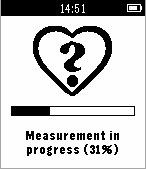
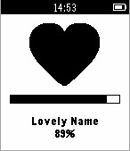

Love Meter Pebble Watchapp
==========================

 1. Configure the application on your phone.  
    

 2. Grab the hand of your idol.

 3. Ask the idol to press the select button to start measurement.  
    

 3. Measurement in progress...  
    

 4. Ask the idol to press the select button to show result of the measurement.  
    

 5. If the result is 50% or more, a full heart is shown. Otherwise, a broken heart is shown.  
     

